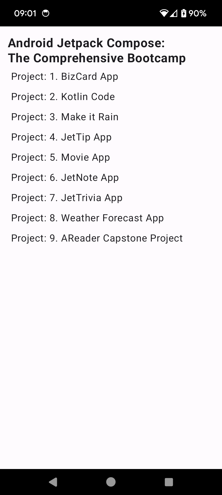

# Cat Facts

This is Udemy [Android Jetpack Compose: The Comprehensive Bootcamp](https://www.udemy.com/course/kotling-android-jetpack-compose-/)  training.

 

## Getting Started

Download the project from [Github](https://github.com/Maniak-pl/Android-Jetpack-Compose-Bootcamp), the updated branch is **master**

### Dependencies

This project uses the following dependencies

- [Compose Foundation](https://developer.android.com/jetpack/androidx/releases/compose-foundation)

## Screenshots

